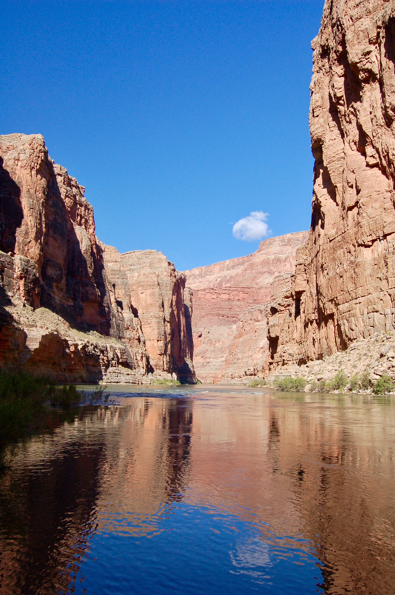

<!--  -->

doTERRA has partnered with Days For Girls to help make sure girls around the globe have access to menstrual care and education and to help all women experience dignity and health. At doTERRA’s 2017 Convention, Wellness Advocates from around the world worked together and broke the GUINNESS WORLD RECORD® for the Most Personal Hygiene Kits Assembled in One Hour. Because of those kits, 5,110 women and girls have the freedom to stay in school and get an education, to interact with their family and community, and to work each day as needed without limitations.

<figure class="video-container">
<iframe loading="lazy" src="https://www.youtube.com/embed/CL3GpEPk7hg?wmode=transparent&amp;modestbranding=1&amp;autohide=1&amp;showinfo=0&amp;rel=0" width="100%" height="100%" frameborder="0" webkitallowfullscreen="" mozallowfullscreen="" allowfullscreen=""></iframe>
</figure>
